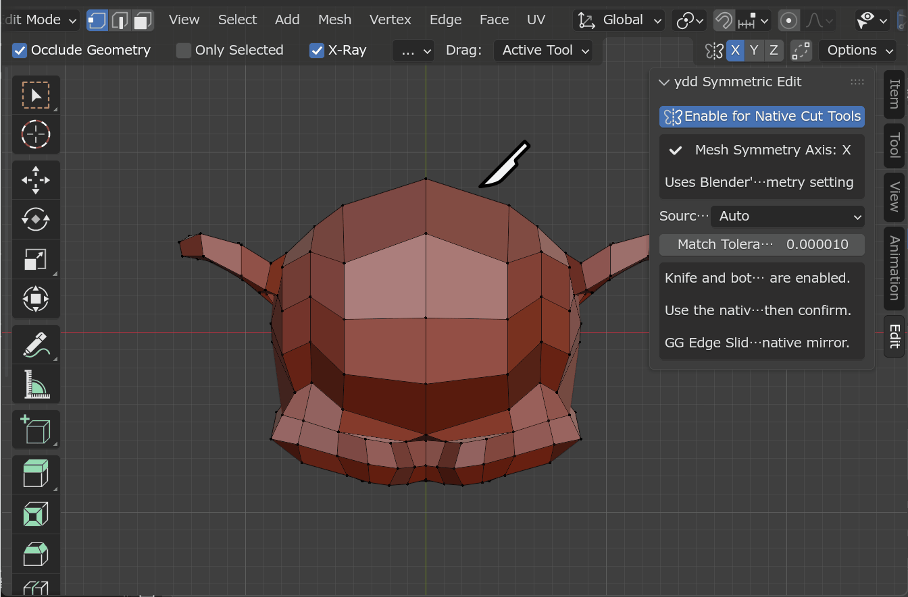

# BlenderSymmetricEditMode

**ydd Symmetric Edit** makes Blender's own editing tools symmetry-aware, without a
Mirror modifier. It covers two families of native operations on an already
symmetrical mesh:

- **Cut tools** — **Knife**, **Loop Cut**, and **Offset Edge Loop Cut**. The
  native modal interaction stays untouched; once the operation is confirmed,
  the new topology is reproduced on the opposite side.
- **Topology edits** — **Rip (V / Alt+V)**, **Vertex Connect (J)**, and
  **Merge Vertices (M)**. The operation runs on the selected side and is
  applied to the mirrored vertices in the same step.
- **Removal tools** — the **Delete menu (X / Del)**, **Dissolve
  Vertices/Edges/Faces**, **Dissolve Selection (Ctrl+X)**, **Edge Collapse**,
  and **Edge Loops**. The selection is expanded to its mirrored counterparts
  and the native operator runs once, so both sides change together.

In both cases the native tool remains the one you are using: shortcuts, modal
controls, operator options, and the Adjust Last Operation (F9) panel all stay
native.



## Install

In Blender 4.2 or later, open **Edit > Preferences > Add-ons**, choose
**Install from Disk**, select the release ZIP, then enable
**ydd Symmetric Edit**.

## Use

1. The mesh must already have matching topology around its object-local origin.
2. In Edit Mode, enable exactly one of Blender's own **Mesh Symmetry X / Y / Z**
   settings in the 3D Viewport header or Tool settings.
3. Open **N panel > Edit > ydd Symmetric Edit** and turn on **Enable Symmetric
   Edit Mode**.
4. Work with the supported tools — on one side or across the plane — and
   confirm normally.
5. The toggle persists across sessions.

## Cut tools (Knife / Loop Cut / Offset Edge Loop Cut)

The add-on does not watch fixed physical keys. It finds the active key
configuration's `mesh.knife_tool`, `mesh.loopcut_slide`, and
`mesh.offset_edge_loops_slide` routes — including custom and Industry
Compatible keymaps — and places a pass-through preparation hook ahead of them.
The same physical event still invokes Blender's operator, so modal controls,
toolbar first-click behavior, the active Workspace Tool, selection, and the
Adjust Last Operation target all behave as usual. The mirrored topology is
created right after the native confirmation.

Loop Cut and Offset results are rebuilt directly on the paired target edges and
faces with BMesh, so curved or self-occluding surfaces do not depend on the
viewport's screen-space projection. Knife paths whose vertices all resolve to
paired boundary edges use the same direct BMesh rebuild; Knife graphs with
intentional interior waypoints or intersections use a Knife Project fallback.
During Offset Edge Loop Cut only, the Mesh Symmetry flags are suspended for the
duration of the native modal operation and restored on every exit path, so its
internal Edge Slide cannot move the opposite half prematurely.

Undo and Redo treat each confirmed native-plus-mirrored result as one
operation. Loop Cut and Offset changes made through **Adjust Last Operation
(F9)** receive the same mirrored post-process; the redo panel itself remains
the native operator.

## Extrude (E / toolbar Extrude tools / Alt+E)

With the add-on enabled and one symmetry axis active, the extrude family is
mirrored right after the native confirmation:

- **E** (Extrude Region and Move), the **Extrude Region**, **Extrude Along
  Normals**, and **Extrude Individual** toolbar tools (both their drag
  gesture and their on-screen gizmo handle), and the **Alt+E** menu entries
  (Extrude Faces, Along Normals, Individual Faces, Edges, Vertices) are all
  supported. Faces, edge paths, and vertices extruded on one side are
  reproduced on the opposite side with the reflected offset, including cap
  and side-face materials, smoothing, and UVs.
- **Selections that touch or lie on the symmetry plane extrude
  symmetrically.** When the native offset stays in the plane, the mirrored
  half shares the seam vertices with the native result instead of splitting
  them, so the seam stays welded. Dragging off-axis opens a symmetric V at
  the seam. A face standing in the plane itself (a fin) extrudes into a
  two-sided symmetric block. Loop Cut rings that land entirely on the plane
  are recognized as already symmetric and finish without a redundant mirror
  pass.
- **Adjust Last Operation (F9)** re-runs the native extrude with the edited
  properties and mirrors the new result again. This works for all supported
  extrude kinds except **Extrude Manifold**, whose offset-dependent dissolve
  and weld behavior cannot be safely repeated; its redo panel stays native
  and one-sided (undo and redo the operation instead).
- **Extrude Manifold** is mirrored only while its result is congruent with a
  plain region extrude (no dissolve or weld triggered). Otherwise the native
  result is kept and the mirror is declined with a warning.
- Zero-offset extrudes (click or Esc without moving) keep the native result
  unmirrored; a warning explains that the mirror was skipped.
- The whole native-plus-mirrored result is one undo step. If the mirror side
  cannot be built (asymmetric topology, missing counterparts), the native
  extrude is kept, the mirror is rolled back completely, and a warning is
  reported.

## Rip (V / Alt+V)

With the add-on enabled and one symmetry axis active, **Rip** and **Rip Fill**
are mirrored after the native confirmation:

- Press **V** (or **Alt+V** for Rip Fill) on a selection on one side, drag,
  and confirm as usual. The same seam is then opened on the opposite side and
  the mirrored vertices receive the reflected final positions. Fill bridge
  faces are recreated with the source fill's material, smoothing, and UVs.
- Edge paths, single vertices, mesh-boundary seams, and zero-distance rips
  (including Esc, which natively keeps the rip) are all reproduced. Native
  Rip tears one connected seam per press; the mirror follows exactly what the
  native tool ripped.
- The whole native-plus-mirrored result is one undo step. If the mirror side
  cannot be reproduced (asymmetric topology, missing counterparts), the
  native rip is kept, the mirror step is rolled back completely, and a
  warning is reported.

Selections may span both sides of the plane: what matters is the seam the
native Rip actually tears. A one-sided seam is mirrored to the other side as
usual. A seam that is its own mirror image — a crack crossing the plane, such
as ripping the edge between two mutually mirrored vertices — opens
symmetrically: the flap you dragged keeps its native position and the
opposite flap receives the reflected one, so the crack opens as a V. A seam
that only partially overlaps its own mirror image keeps the native rip and
declines the mirror step with a warning. Rip still passes through to the
native tool when the selection touches the symmetry plane or when
Proportional Editing or Auto Merge is enabled. When the ripped seam lacks
mirrored counterparts (asymmetric topology), the native rip is kept and the
mirror step is declined with a warning.

**Adjust Last Operation (F9) is not supported for Rip.** This is a limitation
of Blender itself: re-executing `Rip and Move` cannot repeat the rip, so the
native redo panel moves the un-ripped vertices instead (with or without this
add-on). Adjust the gap by moving the still-selected vertices (G) instead.

## Vertex Connect and Merge (J / M)

With the add-on enabled and one symmetry axis active:

- **J** connects the selected vertex path and the mirrored path in one step.
- **M** opens a Merge menu whose **At Center**, **Collapse**, **At First**,
  **At Last**, and **By Distance** entries also merge the mirrored vertex
  clusters. **At Cursor** runs the native merge unchanged.

Both are single undo steps and support the redo panel (for example, adjusting
the By Distance threshold re-applies symmetrically). Vertices on the symmetry
plane are treated as shared by both sides: when a merge lands on the plane, the
mirrored cluster is welded into the same surviving vertex, keeping the mesh
connected.

What happens depends on how the selection relates to its own mirror image —
always with a report, never silently:

- A selection whose mirror image does not intersect the selection itself is
  mirrored normally, even when it has vertices on both sides of the plane.
- A fully self-mirrored selection runs the native operation once; the result
  is already symmetric. **At First** and **At Last** merge each side to its
  own first/last vertex instead, so the two halves stay apart symmetrically;
  selected vertices on the symmetry plane stay put as the shared link
  between the two survivors.
- A selection that partially overlaps its mirror image is completed with the
  missing mirrored vertices first (reported as INFO) and then merged natively
  once. Connect adds the mirror image of the edges the native connect
  actually created, so partially overlapping paths connect symmetrically too.
- A Connect path that crosses its own mirror image is stitched at the
  crossing point on the symmetry plane, the same way the native tool joins
  self-intersecting paths.
- Vertices without a mirrored counterpart are merged natively; a Connect path
  with missing counterparts connects the source side only, with a warning.
- Multi-object Edit Mode, no symmetry axis, or multiple axes: the native
  operator runs unchanged.

Exact coordinate symmetry of **By Distance** results follows the native
`Merge by Distance` behavior of the running Blender version; pairs straddling
the plane merge once, and mismatches stay within the merge distance.

## Delete and Dissolve (X / Del / Ctrl+X)

The add-on finds every key the active keymap binds to the native Delete menu
and to `mesh.dissolve_mode` — including Industry Compatible's Backspace/Del —
and routes them to symmetry-aware replacements. The replacement Delete menu
keeps the native layout; **Limited Dissolve** stays native (out of scope).

- **Delete** (Vertices / Edges / Faces / Only Edges & Faces / Only Faces),
  **Dissolve Vertices / Edges / Faces**, **Ctrl+X**, **Edge Collapse**, and
  **Edge Loops** expand the selection to its mirrored counterparts and run
  the native operator once, preserving its options (including the Blender
  5.x dissolve parameters) in the redo panel.
- Elements without a mirrored counterpart are processed on the selected side
  only and reported as INFO. If any mirrored counterpart is hidden, the
  operation declines with a warning and nothing changes.
- Dissolve, Edge Collapse, and Edge Loops run inside a whole-mesh backup: if
  the single native call still produces an asymmetric result, the mesh is
  rolled back and a warning names the reason.
- Edge Collapse tracks each selected edge cluster through the native call;
  clusters that are their own mirror image collapse onto the symmetry plane
  exactly, and mirrored cluster pairs land on exactly mirrored positions.
- If the panel shows **Delete key route not found**, the active keymap has no
  binding to the native Delete menu for the scanner to replace.

## Direct operator calls

Menu, F3, and scripted calls to the native cut operators bypass the keymap
hook, so they are not mirrored; use a shortcut or toolbar route instead.
Connect and Merge are mirrored through their J / M bindings and the M menu.
The same applies to the removal family: F3 or scripted calls to the native
`mesh.delete` / `mesh.dissolve_*` / `mesh.edge_collapse` operators stay
native, while the X / Del / Ctrl+X routes (and direct calls to the
`mesh.ydd_symmetric_edit_*` operators) are mirrored.

## Scope and data

- Covered operations create or remove topology. Tools that only move existing
  topology, such as Edge Slide (GG), are left to Blender's own Mirror Editing.
- One mesh object in Edit Mode at a time.
- Exactly one Blender Mesh Symmetry axis enabled per operation.
- Both halves must already exist as editable geometry. A missing half supplied
  only by a Mirror modifier cannot be matched.
- Symmetry is evaluated in object-local coordinates around X=0, Y=0, or Z=0.
- Cut targets on the opposite side must have an exact mirrored counterpart
  within **Match Tolerance** before the native operation starts; Connect and
  Merge match individual vertices with the same tolerance.
- Knife strokes may cross the symmetry plane. Both sides of the stroke are
  mirrored toward each other, and a segment crossing the plane is stitched
  to its mirror image at an on-plane vertex — the same X a native
  self-intersecting stroke would produce. Loop cuts on rings that cross the
  plane come out symmetric; a ring left partial by hidden edges declines the
  mirror step with a warning.
- When a mirrored cut segment crosses a cut made on the other side of the
  plane inside the same face — common with freehand strokes across the
  plane — a vertex is inserted at the crossing point and both cuts are
  split there, on both sides symmetrically. Cuts that partially overlap
  their mirror along the same line decline the mirror step with a warning.
- UVs and other CustomData are interpolated on the target side and kept finite,
  but exact parity with every native **Correct UVs** case is not guaranteed.

If post-processing reports an error, the confirmed source result may remain;
use Undo before correcting the axis, tolerance, or source topology.

## Development

The development baseline is Python 3.11, matching Blender 4.2 LTS. The add-on
package lives in `ydd_symmetric_edit/`; Blender-driven tests live in `tests/`.
Ruff handles linting, import sorting, and formatting; ty checks the package
using Blender 4.2 API stubs. From the repository root:

```powershell
uv sync --group dev
uv run ruff check
uv run ruff format --check
uv run ty check
```

Shared semantic types and structural protocols live in
`ydd_symmetric_edit/_types.py`; the test procedure, pass criteria, and release
packaging steps are documented in `docs/testing.md`.

## License

ydd Symmetric Edit is licensed under GPL-3.0-or-later. See `LICENSE` for the
full license text.
